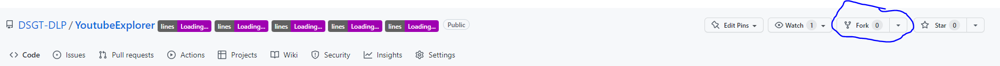

# Youtube Explorer App

This project was bootstrapped with [Create React App](https://github.com/facebook/create-react-app).

## What is this project for?
For those who intend to join the Deep Learning Playground project but want to learn about APIs and React.js in simpler environment, this project will help you to build the basic foundations of React.js plus how to work with backend APIs to build all sorts of applications. 

## How do I see something on the browser?
At the root of the project (ie: at the `~/YoutubeExplorer` path), run `npm run build` to build the app and add the necessary dependencies. Then run `npm start`. You should be able to see a `localhost:3000` server spin up and you will see your content rendered in the browser. 

## What is the goal of this application?
We want to build a platform where you can enter the name of a Youtube Channel and answer some basic questions. 

## How to get started
**VERY IMPORTANT:** Sign up or login to your Github account. Fork a copy of this repo by clicking on the "Fork" button towards the top right




Make sure that you have [Node version 18](https://nodejs.org/en/download/) installed (it should come with npm version 9)

Install Git on your machine. This will act as your version control system

Run `git clone https://github.com/DSGT-DLP/YoutubeExplorer.git`

Follow the instructions in the "How do I see something on the browser?" section to test that something renders in the browser. Once you do this step succesfully, head on over to [ASSIGNMENT.MD](ASSIGNMENT.MD) and follow the instructions there

## How to send edits to your project to Github
You might be making some good progress on the Youtube Explorer app, but then all of a sudden, your computer crashes. All that work you did was lost! How do we prevent this scenario in the future? Well, you can use what's called version control to handle that. This project is version controlled through a tool called `Git`. Git helps manage the state of this project and will detect if you make any changes.

Git is not the same as GitHub. Git is a version control system while GitHub is a website that lets you store your code in what's called a **repository**. 

In order to send your edits from your local editor to Github (as in the website), you need to first tell `Git` what changes you want to send to Github (ie: what will you put in the birthday present?). Once you tell `Git` what you want to send to GitHub, you want to add a message to describe what the change is (ie: what message do you want to deliver to the recipient of the birthday present?). Finally, you need to actually send your changes to GitHub (ie: deliver the birthday present to the recipient). The way you will do this is through this sequence of commands (make sure you `cd` into `~/YoutubeExplorer` first):

```
git add .
git commit -m "<your message here. keep it short and sweet>"
git push
```
`git add .` tells Git what changes you want to send to GitHub
`git commit -m "<your message here>"` tells Git what description to save for the given changes
`git push` actually sends your changes to GitHub.

>After you complete a part of the project (eg: building the text field or the search button), you should run the above sequence of commands to send these important edits to Github

## Extra Resources

You can learn more in the [Create React App documentation](https://facebook.github.io/create-react-app/docs/getting-started).

To learn React, check out the [React documentation](https://reactjs.org/).
